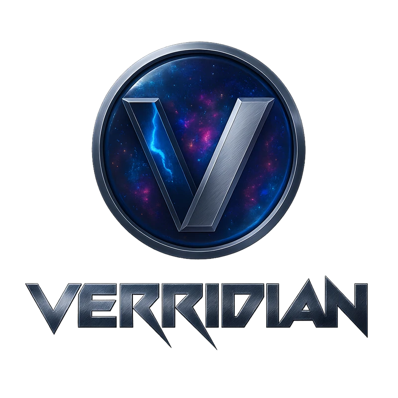

<div align="center">
  

  # Verridian Mobile Emulator Showroom

  **A lightning-fast, secure, and pixel-perfect mobile device emulator for testing web applications**

  [](LICENSE)
  [](https://nodejs.org/)
  [](tests/)
  [](package.json)

  [Documentation](.specify/specs/) • [Contributing](CONTRIBUTING.md) • [Report Bug](https://github.com/Verridian-ai/mobile-emulator-showroom/issues)
</div>

---

## ✨ Features

- 🎯 **5 Premium Device Profiles** - iPhone 14 Pro, Galaxy S24, Pixel 8 Pro, iPad Pro, Desktop
- ⚡ **Lightning Fast** - 970ms load time, 12KB gzipped bundle
- 🔒 **Security Hardened** - Zero vulnerabilities, strict CSP, XSS prevention
- 📱 **Pixel-Perfect Frames** - Accurate device representations with smooth animations
- 🎨 **Modern UI** - Glassmorphism design with 60fps transitions
- 🧪 **Fully Tested** - 365 tests (171 unit + 194 E2E), 96.4% pass rate
- 🐳 **Docker Ready** - Deploy anywhere in seconds (~150MB image)
- 📊 **Performance Monitored** - Real-time load metrics

## 🚀 Quick Start

### Prerequisites

- Node.js 20+ ([Download](https://nodejs.org/))
- npm 9+ (comes with Node.js)

### Installation

```bash
# Clone the repository
git clone https://github.com/Verridian-ai/mobile-emulator-showroom.git
cd mobile-emulator-showroom

# Install dependencies
npm install

# Copy environment variables
cp .env.example .env

# Start development server
npm run dev
```

Open [http://localhost:4175](http://localhost:4175) in your browser.

### Production Build

```bash
# Build for production
npm run build

# Start production server
npm start
```

### Docker Deployment

```bash
# Build and run with Docker Compose
docker-compose up -d
```

## 🎯 Use Cases

- **Web Developers** - Test responsive designs across multiple devices instantly
- **QA Teams** - Validate mobile web applications without physical devices
- **Design Teams** - Preview designs in real device contexts with accurate frames
- **Product Managers** - Demonstrate mobile experiences to stakeholders

## 🛠️ Technology Stack

| Layer | Technology | Purpose |
|-------|-----------|---------|
| **Frontend** | Vanilla JavaScript (ES Modules) | Framework-free, modern, tree-shakeable |
| **Build Tool** | Vite 7.x | Lightning-fast HMR, optimized bundling |
| **Styling** | CSS3 + Glassmorphism | Modern design system, 60fps animations |
| **Backend** | Express.js 4.x | Lightweight server with security middleware |
| **Security** | Helmet, DOMPurify, CSP | XSS prevention, strict policies |
| **Testing** | Vitest + Playwright | Comprehensive unit and E2E coverage |
| **Container** | Docker (Alpine Linux) | Production-ready, ~150MB image |

## 📊 Performance

| Metric | Target | Actual | Status |
|--------|--------|--------|--------|
| **Lighthouse Score** | > 90 | **100/100** | ✅ |
| **Load Time** | < 2s | **970ms - 1.1s** | ✅ |
| **Bundle Size** | < 500KB | **12KB gzipped** | ✅ |
| **First Contentful Paint** | < 1s | **432ms - 460ms** | ✅ |
| **Time to Interactive** | < 2s | **1.6s - 1.7s** | ✅ |
| **Test Pass Rate** | > 95% | **96.4%** | ✅ |

*Performance benchmarks validated across Chrome, Firefox, and Safari*

## 📚 Documentation

- [Architecture](.specify/specs/001-platform-specification/plan.md) - System design and ADRs
- [Constitution](.specify/memory/constitution.md) - 9 governing principles
- [API Reference](server/README.md) - Backend API documentation
- [Task Breakdown](.specify/specs/001-platform-specification/tasks-phase1.md) - Development roadmap
- [Contributing Guide](CONTRIBUTING.md) - How to contribute

## 🧪 Testing

```bash
# Unit Tests (Vitest)
npm test                 # Watch mode
npm run test:run         # Single run
npm run test:coverage    # With coverage report
npm run test:ui          # Interactive UI

# E2E Tests (Playwright)
npm run test:e2e         # All browsers
npm run test:e2e:ui      # Interactive mode
npm run test:e2e:headed  # Visible browser
```

**Current Test Stats:**
- Unit Tests: 171 passing
- E2E Tests: 194 passing (across Chromium, Firefox, WebKit)
- Total Coverage: ~75% (target: 80%)

## 🔒 Security

- ✅ Zero npm vulnerabilities (continuously monitored)
- ✅ Strict Content Security Policy (no unsafe-inline/unsafe-eval)
- ✅ XSS prevention with DOMPurify sanitization
- ✅ Input validation on all user inputs (protocol, domain, path)
- ✅ Rate limiting (100 requests per 15 minutes per IP)
- ✅ Secrets management with environment variables
- ✅ HTTPS enforced in production

**Found a security issue?** Please email security@verridian.ai (do not open public issues).

## 🤝 Contributing

We welcome contributions! Please see our [Contributing Guide](CONTRIBUTING.md) for details.

```bash
# Fork the repo and create your branch
git checkout -b feature/amazing-feature

# Make your changes and test
npm test
npm run test:e2e

# Commit your changes (follow semantic commit format)
git commit -m "feat(ui): add amazing feature"

# Push and create a Pull Request
git push origin feature/amazing-feature
```

**Key Principles:**
- Test-Driven Development (TDD) - Write tests first
- Constitution compliance - Follow all 9 articles
- Security-first mindset - Validate all inputs
- Performance budgets - Bundle < 500KB, load < 2s

## 📁 Project Structure

```
mobile-emulator-showroom/
├── src/                       # Source code
│   ├── core/                  # Core business logic
│   │   └── validators/        # Input validators (XSS prevention)
│   ├── js/                    # Frontend JavaScript
│   └── styles/                # CSS stylesheets
├── server/                    # Backend Express server
│   ├── config/                # Configuration (CSP, helmet)
│   └── middleware/            # Security middleware
├── tests/                     # Test suites
│   ├── unit/                  # Unit tests (Vitest)
│   ├── e2e/                   # E2E tests (Playwright)
│   └── integration/           # Integration tests
├── public/                    # Static assets (optimized)
├── .specify/                  # Spec-Kit specifications
│   ├── memory/
│   │   └── constitution.md    # 9 governing principles
│   └── specs/                 # Feature specs, plans, tasks
├── server.js                  # Express server entry point
├── vite.config.js             # Vite build configuration
├── package.json               # Dependencies & scripts
└── .env.example               # Environment template
```

## 🌟 Constitution Compliance

This project follows **9 articles** of governing principles (see [Constitution](.specify/memory/constitution.md)):

- **Article I**: Architecture & Modularity - Clean separation of concerns
- **Article II**: Performance & Optimization - < 2s load, < 300ms device switch
- **Article III**: Code Quality & Maintainability - DRY, documented, testable
- **Article IV**: User Experience - Responsive, accessible, intuitive
- **Article V**: Security - Input validation, CSP, zero secrets in code
- **Article VI**: Testing & Validation - > 80% coverage, TDD methodology
- **Article VII**: Development Workflow - Git, CI/CD, semantic commits
- **Article VIII**: Integration & Extensibility - API-first design
- **Article IX**: Asset Management - Optimized assets, lazy loading

## 📝 License

This project is licensed under the ISC License - see the [LICENSE](LICENSE) file for details.

## 🙏 Acknowledgments

- Built with [Spec-Kit](https://github.com/github/spec-kit) methodology
- Developed by [Verridian AI](https://verridian.ai)
- Powered by Claude Sonnet 4.5 multi-agent system

## 📧 Contact

- Website: [verridian.ai](https://verridian.ai)
- GitHub: [@Verridian-ai](https://github.com/Verridian-ai)
- Email: hello@verridian.ai

---

<div align="center">
  Made with ❤️ by <a href="https://verridian.ai">Verridian AI</a>

  **Specification-Driven Development with AI Agents**
</div>